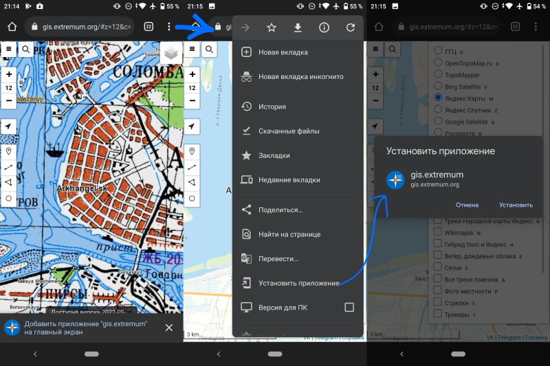
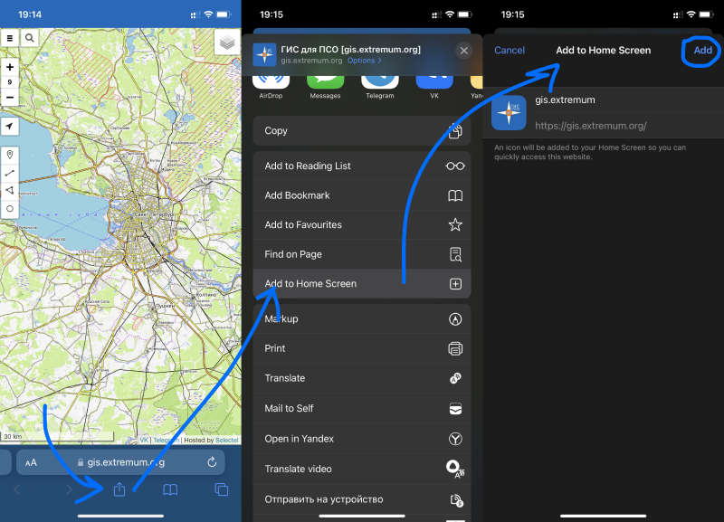

# ГИС для поисково-спасательных отрядов как приложение

Есть небольшие премущества. Можно будет открывать ГИС для ПСО через значок, открывать почти на полный экран, а на компьютерах будет немного быстрее работать, ведь примерно половину производительности отнимают разнообразные блокировщики рекламы, которые проверяют "не реклама ли это?" в каждой из всё время обновляющихся частей карты.

### Android

- откройте страницу [https://gis.extremum.org](https://gis.extremum.org)
- в верхнем правом углу откройте **меню** браузера
- выберите **Добавить на домашний экран**  
<picture>
    
</picture>

### iPhone или iPad

- откройте страницу [https://gis.extremum.org](https://gis.extremum.org)
- внизу экрана нажмите на значок **Отправить** (по середине)
- выберите в списке **Добавить на экран Домой**
- нажмите **Добавить**
<picture>
    
</picture>

### Yandex Browser или Google Chrome на Windows, Linux и macOS

- откройте страницу [https://gis.extremum.org](https://gis.extremum.org)
- в адресной строке браузера нажмите **Установить приложение**
<picture>
    
</picture>
